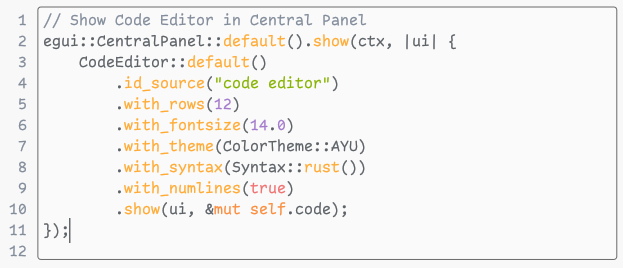
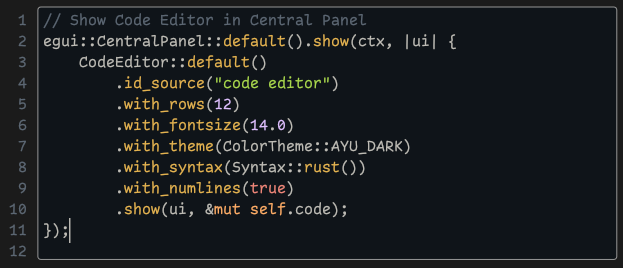
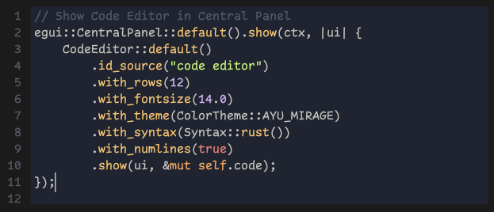
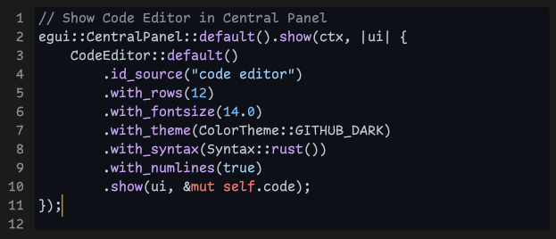
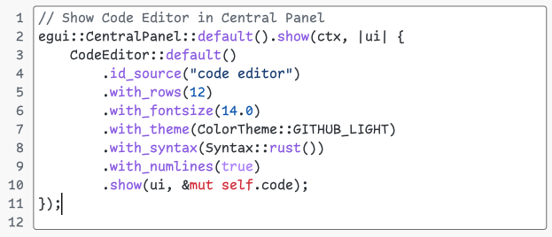
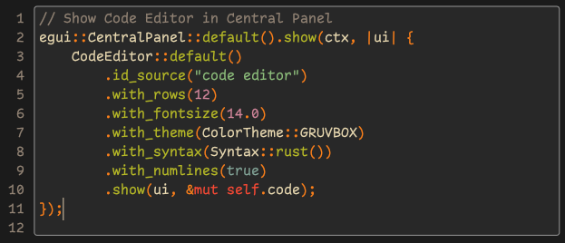
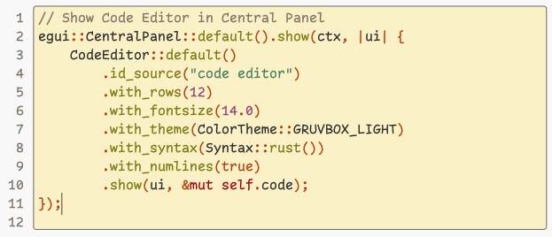
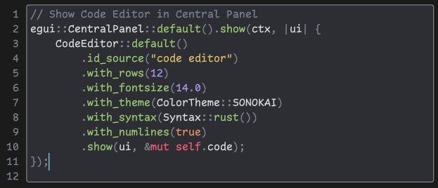

# Egui Code Editor

Text Editor Widget for [egui](https://github.com/emilk/egui) with numbered lines and simple syntax highlighting based on keywords sets.

## Usage with egui

```rust
use egui_code_editor::{CodeEditor, ColorTheme, Syntax};

CodeEditor::default()
  .id_source("code editor")
  .with_rows(12)
  .with_fontsize(14.0)
  .with_theme(ColorTheme::GRUVBOX)
  .with_syntax(Syntax::rust())
  .with_numlines(true)
  .show(ui, &mut self.code);
```

## Usage as lexer

**Cargo.toml**

```toml
[dependencies]
egui_code_editor = { version = "0.2" , default-features = false }
colorful = "0.2.2"
```

**main.rs**

```rust
use colorful::{Color, Colorful};
use egui_code_editor::{Syntax, Token, TokenType};

fn color(token: TokenType) -> Color {
    match token {
        TokenType::Comment(_) => Color::Grey37,
        TokenType::Function => Color::Yellow3b,
        TokenType::Keyword => Color::IndianRed1c,
        TokenType::Literal => Color::NavajoWhite1,
        TokenType::Numeric(_) => Color::MediumPurple,
        TokenType::Punctuation(_) => Color::Orange3,
        TokenType::Special => Color::Cyan,
        TokenType::Str(_) => Color::Green,
        TokenType::Type => Color::GreenYellow,
        TokenType::Whitespace(_) => Color::White,
        TokenType::Unknown => Color::Pink1,
    }
}

fn main() {
    let text = r#"// Code Editor
CodeEditor::default()
    .id_source("code editor")
    .with_rows(12)
    .with_fontsize(14.0)
    .with_theme(self.theme)
    .with_syntax(self.syntax.to_owned())
    .with_numlines(true)
    .vscroll(true)
    .show(ui, &mut self.code);
    "#;

    let syntax = Syntax::rust();
    for token in Token::default().tokens(&syntax, text) {
        print!("{}", token.buffer().color(color(token.ty())));
    }
}
```


## Themes

Based on themes in [Helix Editor](https://github.com/helix-editor/helix).

Font used in examples is [Comic Code](https://tosche.net/fonts/comic-code) by Toshi Omagari.

### Ayu


### Ayu Dark


### Ayu Mirage


### Github Dark


### Github Light


### Gruvbox


### Gruvbox Light


### Sonokai

